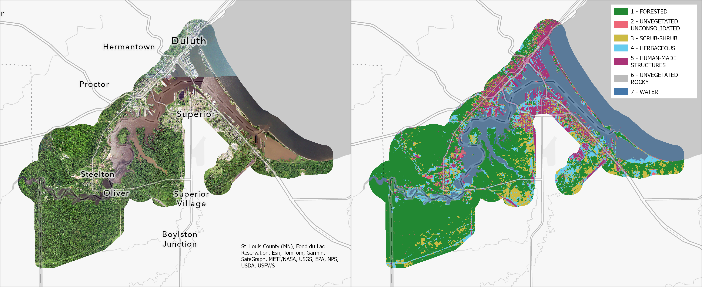
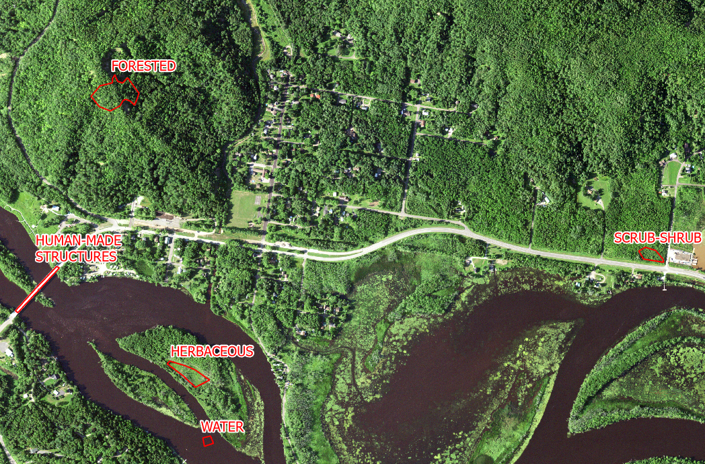
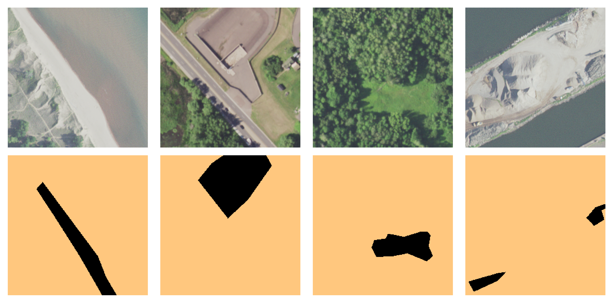

# Land Cover Mapping with U-Net for the St. Louis River Estuary

## Project objective

The objective of this project is to develop tools and methods using open-source geospatial technologies for land cover mapping of the St. Louis River Estuary, near the border between Wisconsin (WI) and Minnesota (MN) in the Duluth-Superior metro area. The main data product from this project is a classified land cover map of the area of interest produced by segmentation of high-resolution aerial imagery with a deep learning approach (U-Net).

Target land cover classes:

- <span style="color:#228833">**1 - FORESTED**</span>
- <span style="color:#EE6677">**2 - UNVEGETATED UNCONSOLIDATED**</span>
- <span style="color:#CCBB44">**3 - SCRUB-SHRUB**</span>
- <span style="color:#66CCEE">**4 - HERBACEOUS**</span>
- <span style="color:#AA3377">**5 - HUMAN-MADE STRUCTURES**</span>
- <span style="color:#BBBBBB">**6 - UNVEGETATED ROCKY**</span>
- <span style="color:#4477AA">**7 - WATER**</span>



## Stage 1. Data Discovery and Compilation

- The source of the aerial remotely sensed data is the [National Agriculture Imagery Program (NAIP) imagery](https://naip-usdaonline.hub.arcgis.com/). NAIP tiles were downloaded from the [USGS Earth Explorer](https://earthexplorer.usgs.gov/). To cover the entire study area, we have merged images with different acquisition dates: 2021/08/13 on the MN side, 2022/08/04 and 2022/07/21 on the WI side. In the overlapping regions WI images took precedence, as they were more recent. Spatial resolution of the resulting mosaic is 0.6 meters. Coordinate Reference System: `NAD 1983 UTM Zone 15N`. Mosaicking was executed through an interactive job submission using SLURM scheduler:
  - `conda activate tensorflow_gpu`
  - `srun -t 5:00:00 -p interactive --mem=128gb -u python mosaic-NAIP-tiles.py`

- Training polygons were produced by visual interpretation of the NAIP imagery and had the following distribution by class:  HUMAN-MADE STRUCTURES (118), HERBACEOUS (72), WATER (56), SCRUB-SHRUB (55), UNVEGETATED ROCKY (51), UNVEGETATED UNCONSOLIDATED (50), and FORESTED (49). Total: 451 polygons.



## Stage 2. Training data pre-processing for U-Net

Because our training polygons have different shapes and sizes, we need to start by creating a pipeline to standardize our data for training a neural network model. From our training polygons we create small **image patches**  and corresponding **label patches** (with 256 by 256 pixels size) by walking through the underlying NAIP imagery. Note that our training patches are sparsely labeled (in any given patch unlabeled background will be ignored by the model). At the end of this process, we obtained 3,471 train and 433 test patches. We used `polygons_to_patches.py` function to achieve this.



### `polygons_to_patches.py`

The script for converting the training data from vector format (e.g. ESRI Shapefile) to a raster that U-Net can use is `polygons_to_patches.py` Python script. This script is run from the command line, with the usage described. Note that activating the `tensorflow_gpu` environment (e.g. `conda activate tensorflow_gpu`) is required to be done first. Once activated, usage of the script can then be produced using: `./ polygons_to_patches.py --help`. This command produces the following output:

```text
./polygons_to_patches.py --help
usage: polygons_to_patches.py [-h] --mosaic_path MOSAIC_PATH [--label_path LABEL_PATH] --polygons_path POLYGONS_PATH --out_path OUT_PATH [--patch_size PATCH_SIZE]
                              [--subdivisions SUBDIVISIONS] [--label_thresh LABEL_THRESH] [--train_split TRAIN] [--test_split TEST] [--rotate [ROTATE]]
                              [--mirror [MIRROR]]

Convert training data from vectors to appropriately sized raster patches for U-Net.

options:
  -h, --help            show this help message and exit
  --mosaic_path MOSAIC_PATH
                        POSIX path to the raster file image containing input observations (aerial image) for U-Net patches.
  --label_path [LABEL_PATH]
                        POSIX path to the raster file containing input class labels for U-Net patches.
                            Default is None. If not specified, a rasterized version of the features will be created
                            on the fly using polygons contained in: --polygons_path
  --polygons_path POLYGONS_PATH
                        POSIX path to input polygons to convert to patches. NOTE: Only ESRI Shapefile has been tested.
  --out_path OUT_PATH   POSIX path to store the output patches.
  --patch_size PATCH_SIZE
                        Patch size used when generating patches. Default is 256 pixels.
  --subdivisions SUBDIVISIONS
                        The division factor used to determine how much patches overlap. E.g. `subdivisions = 2` and `patch_size = 256` will result in
                        subsequent patches overlapping by 128 pixels.
  --label_thresh LABEL_THRESH
                        Pixels threshold used to determine if a patch is kept. Default is 10 pixels in a 256x256 patch.
  --train_split TRAIN
                        Proportion of data set to keep for train. Default value: 0.9.
  --test_split TEST
                        Proportion of data set to keep for test. Default value: 0.1.
  --rotate [ROTATE]     Activate patch augmentation using rotation. Default value: False
  --mirror [MIRROR]     Activate path augmentation using mirroring. Default value: False

```

#### Usage within this project

The following options where used to generate the patches used to train the ensemble of U-Net models:

```text
./polygons_to_patches.py \
    --mosaic_path=/tmp/NAIP_summer_mosaic_cropped.tif \
    --polygons_path=/project/StLouisRiver/TrainingPolygons/PolygonsComb_07_09_2024.shp \
    --out_path=/tmp/st_louis_training_patches/ \
    --patch_size=256 \
    --subdivisions=2 \
    --label_thresh=10 \
    --train_split=0.9 \
    --test_split=0.1 \
    --rotate=False \
    --mirror=False \
```

Running this script will generate a series of subdirectories and output files in the directory specified using the `out_path` argument. In that directory, the following directory structures will be created:

```text
├── out_path direcotry
    ├── augment_stats.json
    ├── test
    │   ├── images
    │   │   ├── 0000003471-0.tif
    │   │   ├── 0000003472-0.tif
    │   │   ├── 0000003473-0.tif
    │   │   ├── ...
    │   ├── labels
    │   │   ├── 0000003471-0.tif
    │   │   ├── 0000003472-0.tif
    │   │   ├── 0000003473-0.tif
    │   │   ├── ...
    ├── train
    │   ├── images
    │   │   ├── 0000000000-0.tif
    │   │   ├── 0000000001-0.tif
    │   │   ├── 0000000002-0.tif
    │   │   ├── ...
    │   ├── labels
    │   │   ├── 0000000000-0.tif
    │   │   ├── 0000000001-0.tif
    │   │   ├── 0000000002-0.tif
    │   │   ├── ...

```

A `test` and `train` directory will be created depending on the options supplied to the script. Each directory will have both an `images` and `labels` subdirectories within them. These will have GeoTiffs with the patches that are used to both train and test the U-Net model. For those not familiar with the Deep Learning models, the `labels` in this case correspond with the numeric values for the classes that are to be identified by the U-Net model. The U-Net modeling process uses both `test` and `train` data. Data in `train` are used to build the model. The data in `test` are used to generate the final accuracy assessment and are NEVER used in the modeling process.

#### Note on `--subdivisions`

The `subdivisions` option is used in many places throughout this code base. Here it is used to determine how much overlap there is between consecutive patches. In this case, the default factor we use is `2` everywhere within this process. In this sense, the following relationship is used to determine how much patches should overlap:

```text
overlap = patch_size / subdivisions
```

For example, in this process we used `patch_size=256 pixels` as the patch size. Employing the above equation with `subdivisions=2` results in consecutive patches that overlap by `128 pixels`.

#### Note on `--rotate=False` and  `--mirror=False` options:

While ultimately not used as part of the model training process, the `polygons_to_patches.py` script can be used to augment the `train-test` data by rotating the patch image to create 0-, 90-, 180-, and 270-degree rotated imagery. Similarly, the mirror option can be used to create 4 sets of mirrors of the original image. Some of the grey literature on Deep Learning suggest that this is a way to artificially augment a train-test dataset by increasing the number of images used to train the image.  While tested, this approach was ultimately not used within our modelling effort. Exploratory evaluation using both `rotate=True` and `mirror=True` did not demonstrably improve the modeling results.

## Stage 3. U-Net training

The following [demo](U-Net-train-single-model.ipynb) describes the U-Net training process. Note that we have separately trained 10 models.

## Stage 4. Predict and ensemble for the entire study area

### Process overview

The process to generate predictions for the whole study area is a two-step process. The high-level steps in this process are:

1. First, we generate smoothed probabilities for each of the models trained in the preceding step. The smoothing step is important to avoid visual artifacts that appear when U-Net generates predictions in 256 by 256 patches (basically, edge effects). The patches need to be concatenated together seamlessly to cover the entire study area. See `predict_mosaic.py` and `predict_mosaic_wrapper.py`.
2. Then we average the individual spatial probabilities from all 10 U-Net models for each given class on a per-pixel basis. The final ensemble prediction is assigned to the class with the highest probability after averaging. See `generate_prediction_ensemble.py`.

### `predict_mosaic.py`

For this process, the predictions for a single model can be accomplished using the `predict_mosaic.py` script. Because the image containing the entire study is too large to fit into memory, the predictions are generated for individual tiles of the study area image, with individual tiles being written to the disk as they are completed. The options for `predict_mosaic.py` can be obtained from the command line using the `--help` option:

```text
./predict_mosaic.py --help
usage: predict_mosaic.py [-h] --mosaic_path MOSAIC_PATH --model_path MODEL_PATH --out_path OUT_PATH --tile_height TILE_HEIGHT --tile_width TILE_WIDTH --n_classes
                        N_CLASSES --patch_size PATCH_SIZE --subdivisions SUBDIVISIONS

Predict for the entire study area with a single model.

options:
  -h, --help            show this help message and exit
  --mosaic_path MOSAIC_PATH
                        POSIX path to mosaic file to segment.
  --model_path MODEL_PATH
                        POSIX path to keras model file.
  --out_path OUT_PATH   POSIX path to store segmentation results, both classes and their associated probabilities.
  --tile_height TILE_HEIGHT
                        Tile height to use for processing.
  --tile_width TILE_WIDTH
                        Tile width to use for processing.
  --n_classes N_CLASSES
                        Number of classes used in the model.
  --patch_size PATCH_SIZE
                        Patch size used in the modelling process.
  --subdivisions SUBDIVISIONS
                        The division factor used to determine how much patches overlap. E.g. `subdivisions = 2` and `patch_size = 256` will result in subsequent patches overlapping by 128 pixels.
```

### `predict_mosaic_wrapper.py`

As noted in the overview for this process, full image predictions are created for each U-Net model generated during Stage 3. While the script that does the actual predictions is `predict_mosaic.py` it is not invoked directly (although it is possible to do so). Instead, the script is called by the wrapper script `predict_mosaic_wrapper.py`. Basically `predict_mosaic_wrapper.py` invokes `predict_mosaic.py` 10 times, with appropriate options for each individual U-Net model. The usage of `predict_mosaic_wrapper.py` is also obtained from the command-line using the `--help` option:

```text
./predict_mosaic_wrapper.py --help
usage: predict_mosaic_wrapper.py [-h] --mosaic_path MOSAIC_PATH --out_path OUT_PATH --tile_height TILE_HEIGHT --tile_width TILE_WIDTH --n_classes N_CLASSES
                                    --patch_size PATCH_SIZE --subdivisions SUBDIVISIONS --json_path JSON_PATH

Predict for the entire study area with multiple models.

options:
  -h, --help            show this help message and exit
  --mosaic_path MOSAIC_PATH
                        POSIX path to mosaic file to segment.
  --out_path OUT_PATH   POSIX path to store segmentation results, both classes and their associated probabilities.
  --tile_height TILE_HEIGHT
                        Tile height to use for processing.
  --tile_width TILE_WIDTH
                        Tile width to use for processing.
  --n_classes N_CLASSES
                        Number of classes used in the model.
  --patch_size PATCH_SIZE
                        Patch size used in the modelling process.
  --subdivisions SUBDIVISIONS
                        The division factor used to determine how much patches overlap. E.g. `subdivisions = 2` and `patch_size = 256` will result in subsequent patches overlapping by 128 pixels.
  --json_path JSON_PATH
                        POSIX path to a JSON file with paths to model files.
```

#### Usage of `predict_mosaic_wrapper.py`

For this process, `predict_mosaic_wrapper.py` was run using the following options:

```text
./predict_mosaic_wrapper.py \
   --mosaic_path=/tmp/NAIP_summer_mosaic_cropped.tif \
   --out_path=/tmp/stLouisRiver/ensembles/inputs/ \
   --tile_height=6400 \
   --tile_width=6144 \
   --n_classes=8 \
   --patch_size=256 \
   --subdivisions=2 \
   --json_path=/project/StLouisRiver/models/models_runs.json  \
```

#### Note on `tile_height` and `tile_width`

Here, both the `tile_height` and `tile_width` are the dimensions of the subsets of the image in pixels that can fit into memory. Here the `subdivisions` argument is the same as the `subdivisions` option in Stage 2. The options used for both `--tile_height=6400` and  `--tile_width=6144` may seem a bit odd. For those unfamiliar with what the smoothing process does (see references at the end of this document or this [article on Medium](https://medium.com/vooban-ai/satellite-image-segmentation-a-workflow-with-u-net-7ff992b2a56e)), the rationale for smoothing the probabilities is to help remove edge effects that are an inherent part of the U-Net segmentation process. Without smoothing and overlapping prediction of patches, edge effects can become quite evident in the final product. That is, smoothing helps rectify edge effects within a specific tile that result from the fact that predictions ultimately are done at a patch level. While smoothing helps to address edge effects within a tile, there is a potential for edge effects to also exist in the final image where tile edges meet. To minimize any potential tile-edge effects, it is ideal to minimize the number of tiles within a final image by using larger values for `tile_height` and `tile_width`. The challenge is that larger tile sizes require more computer memory, which may not always be available. Hence, there is a tradeoff between trying to minimize the number of tiles (e.g. maximizing their size) and requesting computing resources that can run the job. Here, the options of `tile_height=6400` and `tile_width=6144` help strike a balance between minimizing the number of tiles (thus minimizing potential influence of potential edge effects) and the computing resources to run the job.

### `generate_prediction_ensemble.py`

The script that generates the ensemble from the 10 predictions is `generate_prediction_ensemble.py`. The usage of the script is available from the command line using the `--help` option:

```text
./generate_prediction_ensemble.py --help
usage: generate_prediction_ensemble.py [-h] --out_path OUT_PATH --tile_height TILE_HEIGHT --tile_width TILE_WIDTH --n_classes N_CLASSES --in_path
                                                IN_PATH [--scale_factor SCALE_FACTOR]

Uses probabilities generated from multiple models and averages them into an ensemble result.

options:
  -h, --help            show this help message and exit
  --out_path OUT_PATH   POSIX path to store final segmentation results, both classes and their associated probabilities.
  --tile_height TILE_HEIGHT
                        Tile height to use for processing.
  --tile_width TILE_WIDTH
                        Tile width to use for processing.
  --n_classes N_CLASSES
                        Number of classes used in the model.
  --in_path IN_PATH     POSIX path to probabilities files from individual models.
  --scale_factor SCALE_FACTOR
                        Scale factor used to convert probabilities from integers to floats. Default value: 10,000
```

#### Usage of `generate_prediction_ensemble.py`

For this project, `generate_prediction_ensemble.py` was called with the following options:

```text
./generate_prediction_ensemble.py \
   --out_path=/project/stLouisRiver/ensemble/ \
   --tile_height=5120 \
   --tile_width=5120 \
   --n_classes=8 \
   --in_path=/project/stLouisRiver/results/ensembles/inputs_uc/ \
   --scale_factor=10000 \
```

#### Note on `tile_height` and `tile_width`

Similarly to the previous process, in order to generate the final ensemble, all tiles must be held within the computer's memory in order to average their values. This creates a similar tension between wanting larger tiles, so the process runs faster, but still being able to run with the requested computing resources. Here `tile_height=5120` `tile_width=5120` meant the job would run with a somewhat higher memory allocation without having to request a very large memory node (e.g. 1 TB memory), which would mean having to wait longer for a node with adequate resources. Such tradeoffs are an inherent part of shared computing environments.

## Stage 5. Accuracy assessment

Our accuracy assessment methods and results for our ensemble classified map are described in this [demo](U-Net-accuracy-assessment-ensemble.ipynb).

## Data release

To upload files to s3 bucket, we used the following command:

- `s3cmd put NAIP_summer_mosaic_cropped.tif s3://stlouis-estuary-habitat`

The following intermediate and final data products are available for public use:

- NAIP mosaic of the study area: https://s3.msi.umn.edu/stlouis-estuary-habitat/NAIP_summer_mosaic_cropped.tif
- Shapefile of the study area: https://s3.msi.umn.edu/stlouis-estuary-habitat/study_area_extended.zip
- Shapefile with training polygons: https://s3.msi.umn.edu/stlouis-estuary-habitat/TrainingPolygons.zip
- Final classified map generated from ensemble of 10 U-Net models: https://s3.msi.umn.edu/stlouis-estuary-habitat/st_louis_naip_unet_ensemble_10mods_predict.tif
- Class probability for the final classified map generated from ensemble of 10 U-Net models: https://s3.msi.umn.edu/stlouis-estuary-habitat/st_louis_naip_unet_ensemble_10mods_max_probability.tif (note: this layer serves as a measure of model confidence, not model accuracy)

## System requirements

This workflow was successfully executed using [the University of Minnesota's Minnesota Supercomputing Institute's (MSI) High Performance Computing (HPC) systems](https://msi.umn.edu/about-msi),  specifically nodes with GPUs, which were critical to train neural network models efficiently. For details on setting up a Python environment with GPU-enabled `TensorFlow`, see the [environment setup instructions](./docs/environment_setup.md). In addition to Python, we used other open-source tools ([S3cmd](https://s3tools.org/s3cmd), [SLURM Workload Manager](https://slurm.schedmd.com/documentation.html)).

## References

- U-Net original formulation: Ronneberger, O., Fischer, P., Brox, T. (2015). U-Net: Convolutional Networks for Biomedical Image Segmentation. In: Navab, N., Hornegger, J., Wells, W., Frangi, A. (eds) Medical Image Computing and Computer-Assisted Intervention – MICCAI 2015. MICCAI 2015. Lecture Notes in Computer Science(), vol 9351. Springer, Cham. https://doi.org/10.1007/978-3-319-24574-4_28
- Smooth predictions reference code 1: [smooth_tiled_predictions.py](https://github.com/bnsreenu/python_for_microscopists/blob/master/229_smooth_predictions_by_blending_patches/smooth_tiled_predictions.py) by Dr. Sreenivas Bhattiprolu.
- Smooth predictions reference code 2:
[Smoothly-Blend-Image-Patches](https://github.com/Vooban/Smoothly-Blend-Image-Patches) by Guillaume Chevalier, comes with [MIT license](https://github.com/Vooban/Smoothly-Blend-Image-Patches/blob/master/LICENSE).
- [Segmentation Models Python library](https://segmentation-models.readthedocs.io/en/latest/index.html)

## Acknowledgments

This work is/was sponsored by the National Estuarine Research Reserve System Science Collaborative, which supports collaborative research that addresses coastal management problems important to the reserves. The Science Collaborative is funded by the National Oceanic and Atmospheric Administration and managed by the University of Michigan Water Center (NA19NOS4190058). The project team is also grateful for the computational infrastructure and resources and provided by the [Minnesota Supercomputing Institute](https://msi.umn.edu/). Both [Microsoft's Copilot](https://copilot.microsoft.com/) and [OpenAI's ChatGPT](https://chatgpt.com/) were used for generic code advice during this project.
